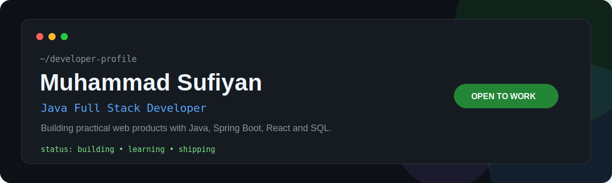

<p align="center">
  
</p>

<h1 align="center">Muhammad Sufiyan</h1>

<p align="center">
  <strong>Java Full Stack Developer</strong> &nbsp;•&nbsp; <strong>Founder of FileWalaTool</strong>
</p>

<p align="center">
  <a href="https://mdsufidev.vercel.app"></a>
  <a href="https://www.filewalatool.com"></a>
  <a href="https://github.com/Sufi111729"></a>
  <a href="https://www.linkedin.com/in/mdsufidev/"></a>
</p>

---

## About Me

**Muhammad Sufiyan (@Sufi111729)** is a Java Full Stack Developer from India and the founder of [FileWalaTool](https://www.filewalatool.com). I build fast, responsive, and user-friendly web applications along with browser-based PDF, image, and document tools.

> My focus is practical product development: clear interfaces, reliable REST APIs, structured data workflows, and software that solves everyday user problems.

- Building with **Java, Spring Boot, React, JavaScript, SQL, and REST APIs**
- Interested in backend development, clean UI/UX, browser-based processing, and deployment workflows
- Open to **Java Developer** and **Full Stack Developer** opportunities

---

## Featured Project — FileWalaTool

### [FileWalaTool](https://www.filewalatool.com)

A browser-based platform for image, PDF, and document tools, designed for **fast processing**, **privacy-focused handling**, and an **easy user experience**.

**What users can do**

- Resize, crop, compress, and convert images
- Merge, split, rotate, watermark, and protect PDF files
- Prepare PAN photos, passport photos, and resized signatures
- Use streamlined document utilities from desktop or mobile browsers

<p>
  <a href="https://www.filewalatool.com"></a>
</p>

---

## Tech Stack

<p>
  
  
  
  
  
</p>

<p>
  
  
  
  
  
</p>

**Also working with:** HTML, CSS, SQL, MySQL, REST APIs, responsive design, browser-based file processing, and Git workflows.

---

## What I Build

| Focus area | Work |
| :-- | :-- |
| **Backend** | Java and Spring Boot applications, REST APIs, and CRUD systems |
| **Frontend** | Responsive React and JavaScript interfaces with clear, usable UI |
| **Data** | SQL and MySQL-based integrations with structured workflows |
| **Products** | Browser-based PDF, image, and document utilities |
| **Experience** | Mobile-friendly interfaces built around speed and usability |

---

## Current Focus

```text
BUILDING    → Real-world Java full stack products
IMPROVING   → Spring Boot, REST APIs, SQL, architecture, and deployment
SHIPPING    → Practical tools that provide clear user value
EXPLORING   → Better UX for browser-based file workflows
```

---

## Connect With Me

- **Portfolio:** [mdsufidev.vercel.app](https://mdsufidev.vercel.app)
- **FileWalaTool:** [www.filewalatool.com](https://www.filewalatool.com)
- **GitHub:** [github.com/Sufi111729](https://github.com/Sufi111729)
- **LinkedIn:** [linkedin.com/in/mdsufidev](https://www.linkedin.com/in/mdsufidev/)

<p align="center">
  <sub>Muhammad Sufiyan · Sufi111729 · Java Full Stack Developer · Founder of FileWalaTool</sub>
</p>
